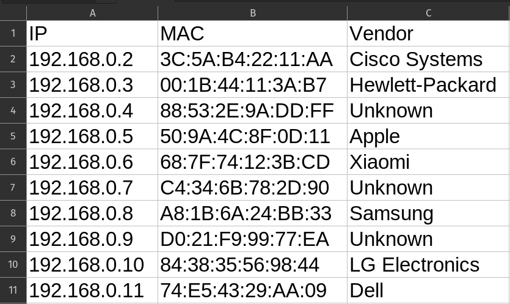

# 🖧 Scanner de Rede Local

O objetivo do script é fazer um [Ping Scan (Host Discovery sem escanear portas)](https://nmap.org/book/man-host-discovery.html)
da rede local e gerar um relatório em CSV contendo informações como endereço IP,
endereço MAC e Vendor (Fabricante da Placa de Rede dos dispositivos).

Para realizar esse scan no terminal, o comando escolhido seria algo do tipo
`sudo nmap -sn <range_de_endereços_IP>`. Como queremos automatizar isso com Python,
escolhi a biblioteca [python-nmap](https://pypi.org/project/python-nmap/) que
serve como um wrapper para o nmap e facilita o uso da ferramenta dentro do
script.

Para podermos fazer o scan da rede, precisamos de um endereço IP daquela rede
e a forma escolhida para obter essa informação foi a utilização da biblioteca
[netifaces](https://pypi.org/project/netifaces/). Nessa lib, tem um método
chamado `gateways` que nos dá informações sobre os gateways da máquina. Além de
resolver o problema de achar de forma automática um endereço IP da rede, essa
lib também resolve o problema de encontrar o endereço MAC da própria máquina. O nmap não
fornece o endereço MAC do localhost, então tive que utilizar esse artifício para
disponibilizar esse dado no relatório final.



## 💿 Como rodar na sua máquina (Linux)

### 📝 Pré-requisitos:

- [Git](https://git-scm.com/downloads)
- [Nmap](https://nmap.org/download.html)
- [Python 3.x](https://www.python.org/downloads/)

```bash
# Clonando o projeto e entrando na pasta
$ git clone https://github.com/lleonardus/scanner-rede-local.git
$ cd scanner-rede-local

# Configurando virtual environment e instalando as dependências
$ python3 -m venv .venv
$ source .venv/bin/activate
$ python3 -m pip install -r requirements.txt

# Agora é só executar o script, que deve gerar um arquivo report.csv na raiz
# do projeto
$ python3 script.py
```

## 🧰 Ferramentas Utilizadas

- [Git](https://git-scm.com/downloads)
- [Nmap](https://nmap.org/download.html)
- [Python](https://docs.python.org/3/)
- [python-nmap](https://pypi.org/project/python-nmap/)
- [netifaces](https://pypi.org/project/netifaces/)
