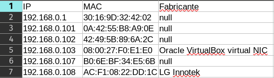

# 🖧 Scanner de Rede Local

&rarr; Um script simples feito em Python com os objetivos de:

- Descobrir todos os dispositivos ativos na rede local;
- Gerar uma tabela com IP, MAC e Fabricante da placa de rede desses dispositivos;
- Exportar os resultados para um arquivo CSV.



## 💿 Como rodar na sua máquina (Linux)

&rarr; Dentro do script, tem uma variável chamada `INTERFACE`. Antes de rodar o script,
você deve setar essa variável para o nome da sua interface de rede default. Esse
nome pode ser obtido através do comando `ip route`.

```bash
# Clonando o projeto e entrando na pasta
$ git clone https://github.com/lleonardus/scanner-rede-local.git
$ cd scanner-rede-local

# Configurando virtual environment e instalando as dependências
$ python3 -m venv .venv
$ source .venv/bin/activate
$ python3 -m pip install -r requirements.txt

# Agora é só executar o script, que deve gerar um arquivo relatorio.csv na raiz
# do projeto
$ python3 script.py
```

## 🧰 Ferramentas Utilizadas

- [Python](https://docs.python.org/3/)
- [python-nmap](https://pypi.org/project/python-nmap/)
- [netifaces](https://pypi.org/project/netifaces/)
